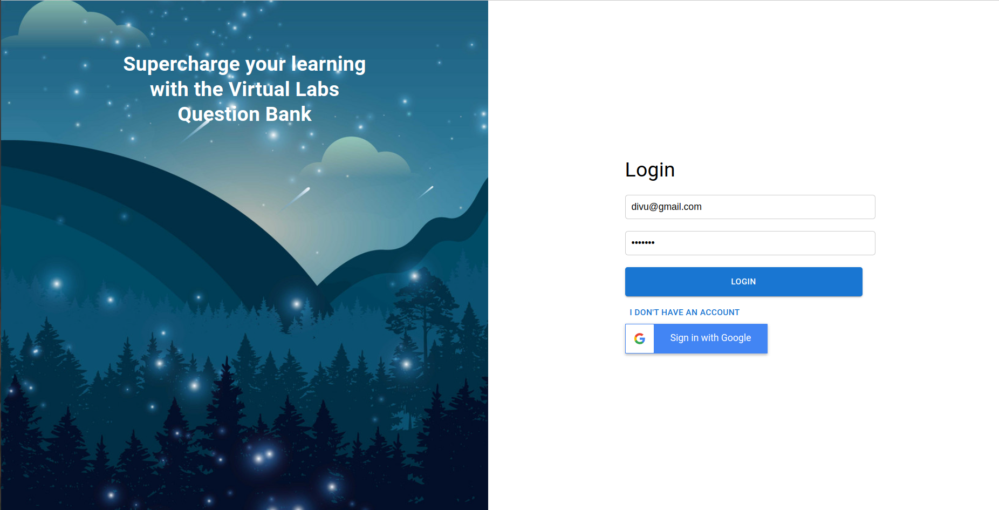
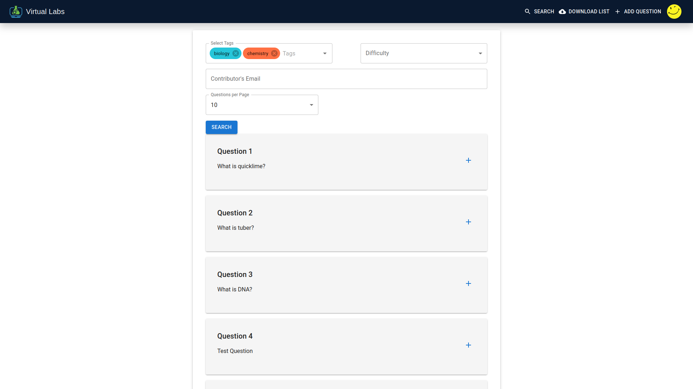
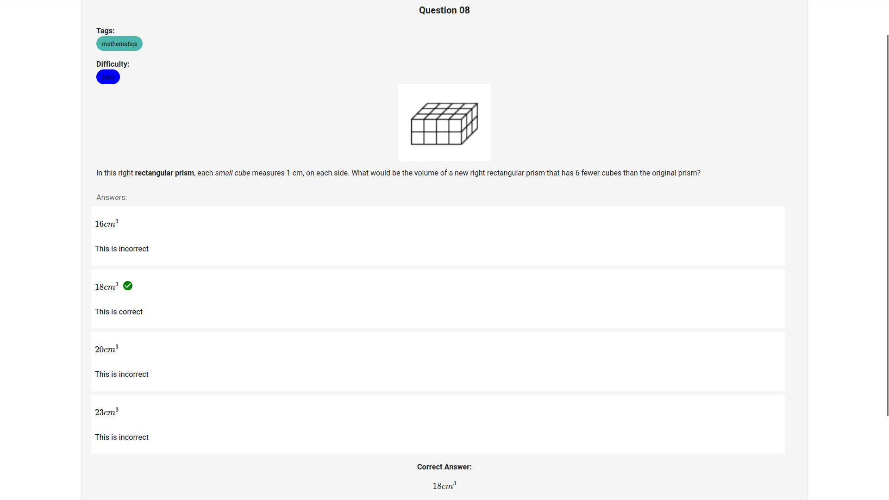
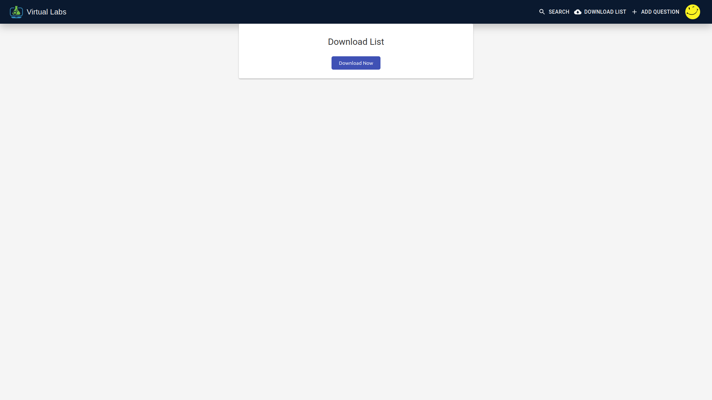
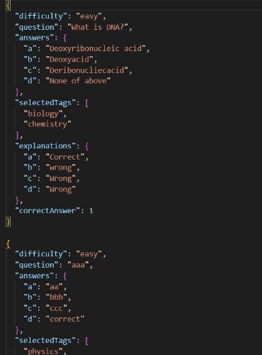
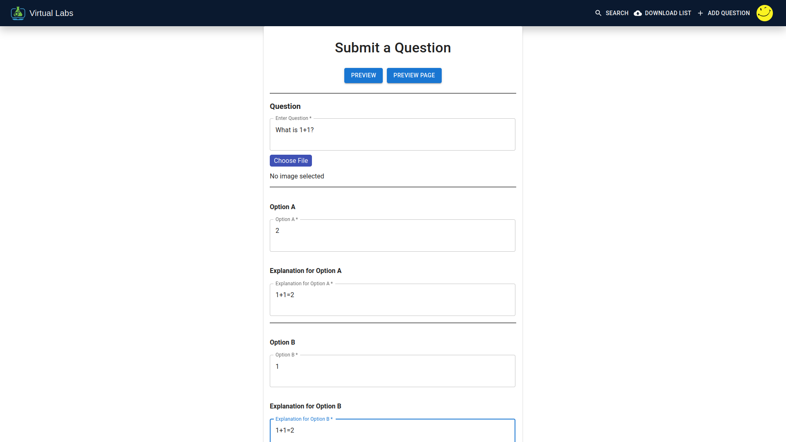
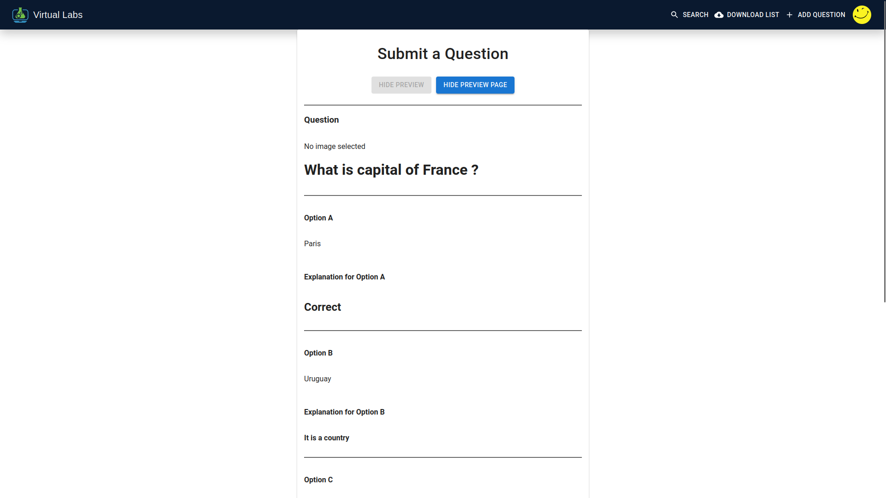
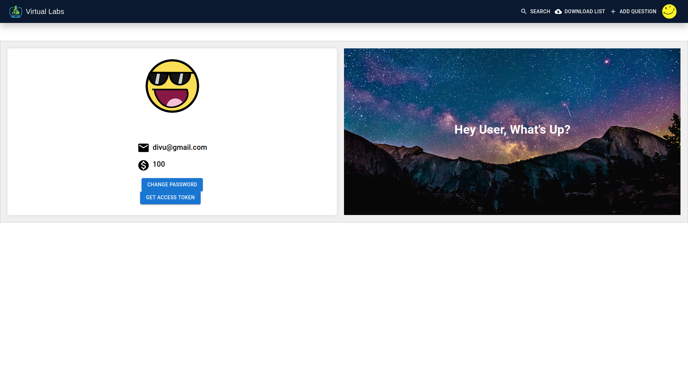

# Virtual Labs Question Bank

## Introduction

The Virtual Labs Question Bank allows users to access a wide array of questions. They can download these questions or even upload their own.

## Target User

This service is targeted towards teachers/professors at all levels of education.

## User Interface

Visit https://vlabs-question-bank.web.app/login for starting the Application

1. **Login**

    Users land on the login screen where they can:
    - Log in with their email ID and password or use Google login.
    - EMAIL must have @
    - Password must be a minimum of six characters
    - Unfollowing of above constraints give errors
    - Sign up if they don’t have an account.
    - To sign up click on "I don't have an account option"
    - Click on Google sign in Button on Login Page to Google Sign In the service 

    

2. **Question Search**

    Users can search for questions by:
    - Tags
    - Difficulty level.
    - Filter by the person who submitted the question.
    - Select the number of questions per page.
    
    Upon clicking the ‘+’ sign next to a question, it is added to the Download List. Clicking again changes it to ‘-‘, removing the question.

    

    

    Clicking on a question displays it in full with options and correct answers. Images can be enlarged by clicking on them. Users can add questions to their list from this page.

3. **Download List**

    Selected questions for download are displayed here. Users can remove a question by clicking the ‘x’ next to it. Clicking "Download Now" downloads a JSON file with the questions.

    

    

4. **Add Question**

    Users can add questions to the database by providing details such as the question, options, explanations, correct answer, tags, and difficulty level.

    

    Users can as well see the preview of the questions added (Markdown,image,etc) by clicking on Preview/Preview Page button on Add Question Screen.

    

5. **Profile Page**

    Users can view their credits, gained by submitting questions and spent on downloads. They can also change their password.
    To call APIs , Access Tokens are required which can be copied from the profile page.

    

6. **Log Out**

    Users can log out from the navbar, which redirects them to the login page.

    
