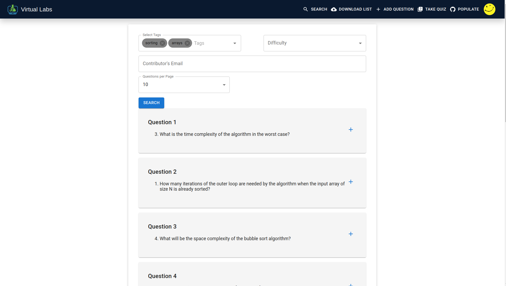

# VLabs Question Bank

Welcome to the VLabs Question Bank user documentation. This guide will help you navigate and utilize the various features of our platform.

## Table of Contents

- [Getting Started](#getting-started)
  - [Login/Signup](#loginsignup)
  - [Navigation](#navigation)
- [Features](#features)
  - [Common Features (Available for all roles)](#common-features-available-for-all-roles)
  - [Administrator-Only Features](#administrator-only-features)
  - [Contributor-Only Features](#contributor-only-features)
  - [Quiz Participant-Only Features](#quiz-participant-only-features)
  - [Roles vs. Functionalities](#roles-vs-functionalities)
- [Using the Platform](#using-the-platform)
- [Search Functionality](#search-functionality)
- [Download Questions](#download-questions)
- [Adding Questions](#adding-questions)
- [Populate Database](#populate-database)
- [Quiz Interface](#quiz-interface)
  - [Review Test](#review-test)
- [Updating Questions](#updating-questions)
- [Temporary Features](#temporary-features)

## Getting Started

### Login/Signup

1. **Access the Login Page:** [VLabs Login](https://vlabs-question-bank.web.app/login)
2. **Login:** Enter your existing username and password and click on "Enter".
3. **Signup:**
   - Fill in your email ID and password (at least 6 characters) and click on "Next".
   - Select your roles: "Administrator", "Contributor", "Question User", or "Quiz Participant". You can choose multiple roles at once.
   - The present version does NOT support Google Login 

### Navigation

Upon logging in, you will see all available functionalities on the NAVBAR. Depending on your role, you can access different features.

## Features

### Common Features (Available for all roles)

1. **Search for Questions:** Available for "Administrator", "Contributor", "Question User", and "Quiz Participant".
2. **Add to Download List:** Available for "Administrator", "Contributor", "Question User", and "Quiz Participant".
3. **View Questions:** Available for "Administrator", "Contributor", "Question User", and "Quiz Participant".
4. **Download Questions:** Available for "Administrator", "Contributor", "Question User", and "Quiz Participant".

### Administrator-Only Features

1. **Update Questions**
2. **Add Question to Database**
3. **Populate Database**
4. **Take Quiz:** Also available for "Quiz Participant"

### Contributor-Only Features

1. **Add Question to Database**
2. **Take Quiz:** Also available for "Quiz Participant"

### Quiz Participant-Only Features

1. **Take Quiz**

The above is Question User screen

### Roles vs Functionalities
| Role             | Search for Questions | Add to Download List | View Questions | Download Questions | Update Questions | Add Question to Database | Populate Database | Take Quiz |
| :--------------: | :------------------: | :------------------: | :------------: | :----------------: | :--------------: | :----------------------: | :---------------: | :-------: |
| Administrator    | 1                    | 1                    | 1              | 1                  | 1                | 1                        | 1                 | 1         |
| Contributor      | 1                    | 1                    | 1              | 1                  | 0                | 1                        | 0                 | 1         |
| Question User    | 1                    | 1                    | 1              | 1                  | 0                | 0                        | 0                 | 0         |
| Quiz Participant | 1                    | 1                    | 1              | 1                  | 0                | 0                        | 0                 | 1         |

## Using the Platform

1. **Navigation:** Use the navbar to navigate through different screens and functionalities as described above.
2. **Access Restricted Pages:** If you try to access a page not assigned to your role, an "Access Restricted" message will be displayed. Navigate to [VLabs Login](https://vlabs-question-bank.web.app/login) to regain control.

## Search Functionality

1. **Version 1 Questions:** Allows multidimensional search (by tags, difficulty, and email).
2. **Version 2 Questions:** Search by tags or multitags.

## View Questions
 **Display:** All questions from both versions will be displayed on the screen. You can choose to view a particular question in the QUESTION view screen.

 

## Download Questions

1. **Download Page:** Click the download button on the Downloads Page to download questions in JSON format.

## Adding Questions

1. **Version 1 Questions:** Can be added using the ADD QUESTIONS screen.
2. **Version 2 Questions:** Populated using the "GitHub Link Onboarding" feature.

## Populate Database

Administrators can populate the database using the "Populate Database" page.

1. **Select an Experiment GitHub Repository Link:** Ensure the link does not contain "/main".
2. **Fetch Questions:** Click on the Fetch button to populate the QUESTION database with all VERSION 2 questions from all possible "assessment" files in GitHub repositories (e.g., pretest.json).
3. **Error Handling:**
   - If no JSON files are found, an error message will be displayed.
   - If JSON files are found but do not have a valid version 2, they will not be populated, and an error message will be displayed.
   - If JSON files follow version 2, a "SUCCESS" message will be displayed in green.
4. **Google Sheet Columns:** "Experiment Name", "Tags", and "Source Repo" are used in database population.

## Quiz Interface

1. **Select Tags:** Users can select tags and appear for a quiz based on the selected tags.
2. **Start Quiz:** Click the "Start Quiz" button after selecting relevant tags. You will be directed to the /exam/0 page to start with question 1. The NAVBAR disappears to create an "Exam-like" interface.

3. **Exam Navigation:**
   - Large and medium devices: Navigation pane on the right.
   - Small devices: Top menu to display the navigation pane.

4. **End Test:** Click the "End Test" button to complete the quiz.
5. **Results:** You will be directed to the /results page with your score. Click "Review Test" to review your answers.

### Review Test

The interface of REVIEW is mostly the same as the EXAM except for the following differences:

1. Not attempted questions are shown with "Not attempted" text on the right side of the question number.
2. Wrong questions are shown with a "CROSS".
3. Correct questions are shown with a "TICK".
4. Explanation of options and the correct answer in green is provided below each question.

## Updating Questions

Administrators can update questions by clicking the "Update" button on the top right of the Question VIEW screen.

1. Present question entries will be displayed in boxes.
2. Modify any entry as needed.
3. Click "Submit" to modify the question.

---

## Profile Page and API docs
1. Users can view a=their profile and access the "Access Token" as mentioned in "Technical Documentation"

For any further assistance or queries, feel free to contact our support team.

Happy Learning!

# Temporary Features

1. The Selecting of ROLES is kept only for testing purposes
2. After testing , removal of this feature will take place
3. By default any new USER EMAIL , will get then role of "Question User"
4. If he needs other roles , only Administrator can grant them
5. To implement this go to https://console.firebase.google.com/project/vlabs-question-bank/firestore/
   In the Collection named "Users" , find the EMAIL ID for whom you want to provide Extra ROLES . Add roles names to KEY "role" in the document by clicking "PLUS" sign beside it

   
